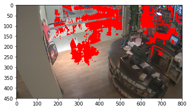

# Motion-Detect

## Demo Image

## Requirements: Anaconda, Spyder (Python v2.7)

## Description:
Motion Detect is a research project that I have been working on. The concept of this project is to create a marked image that is resulted from gradual motion on them. The image themselves are part of a video which is from our university cafeteria.
